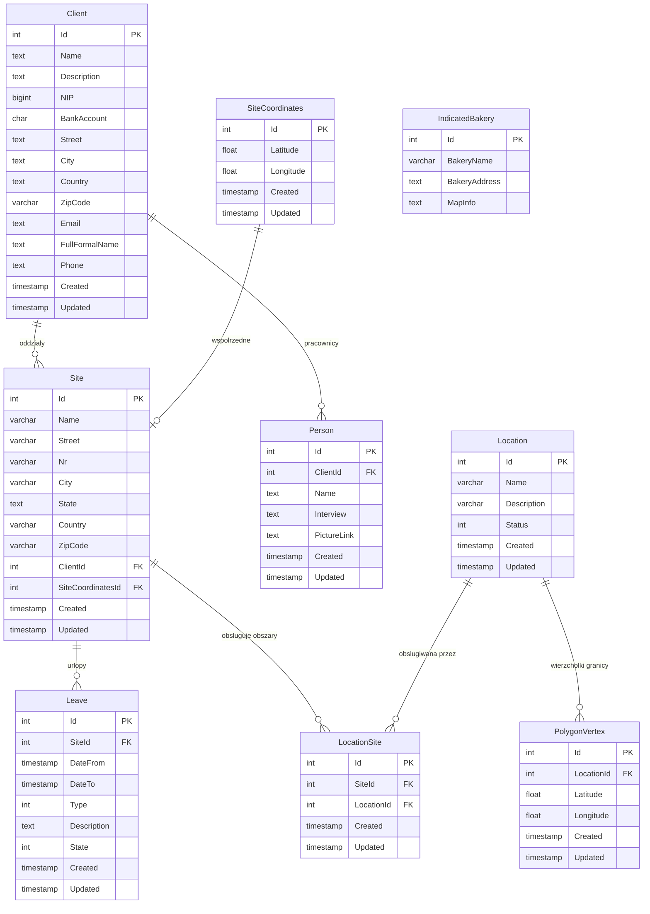
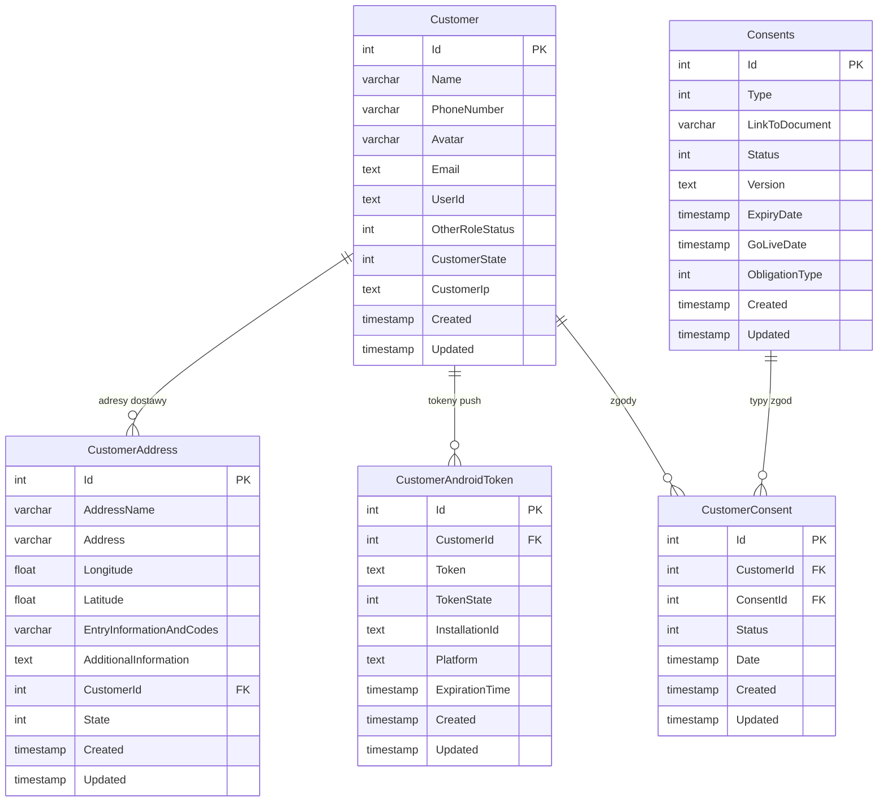
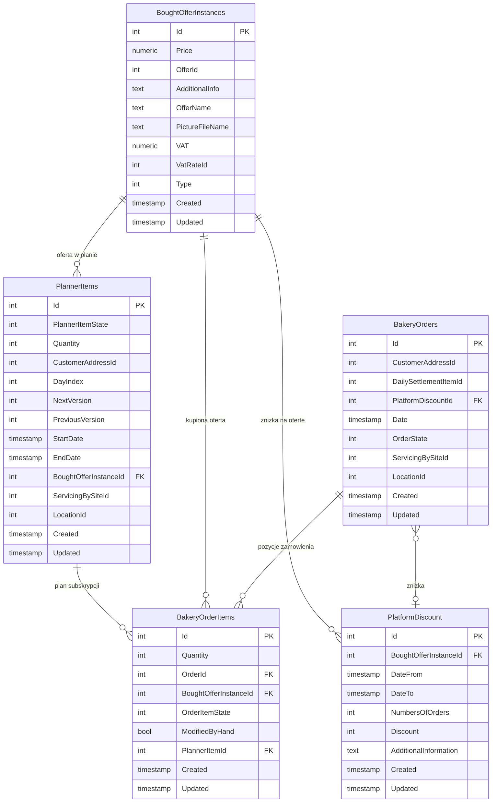
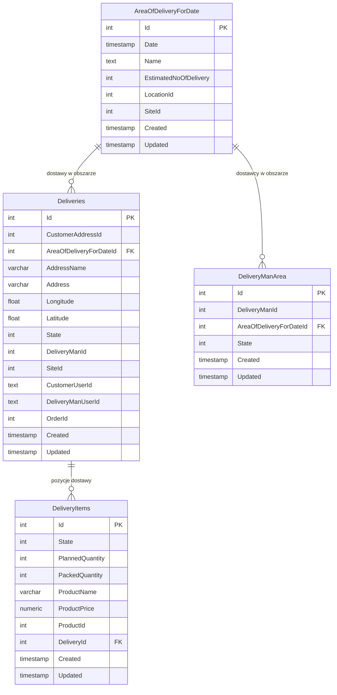
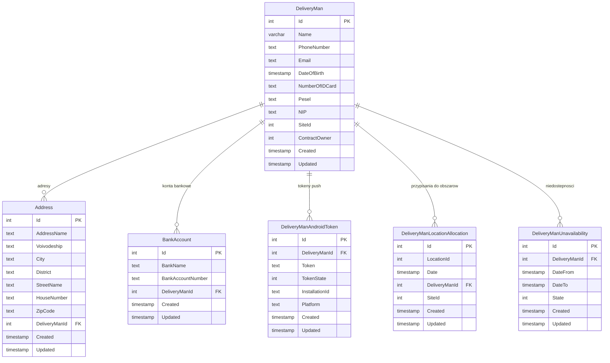
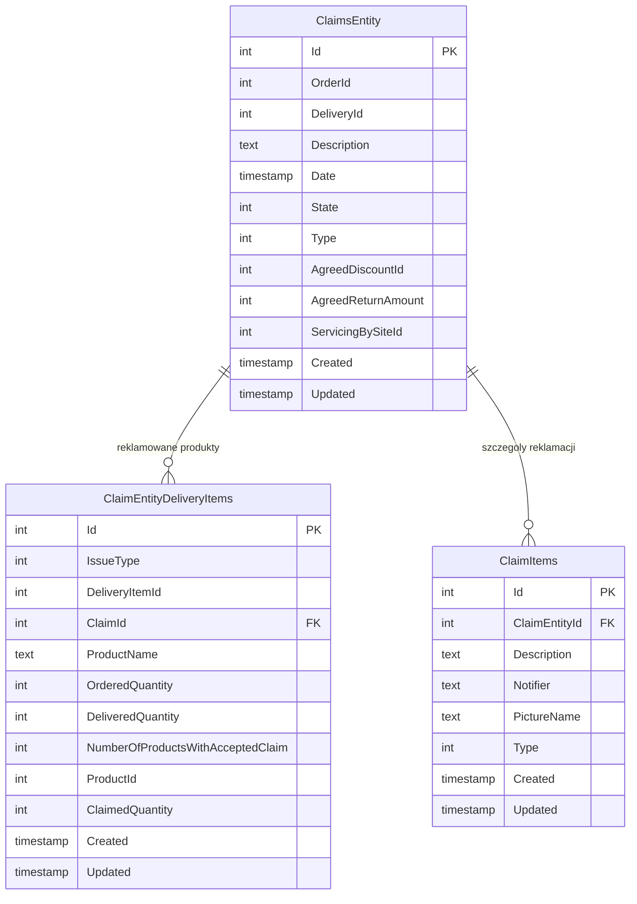
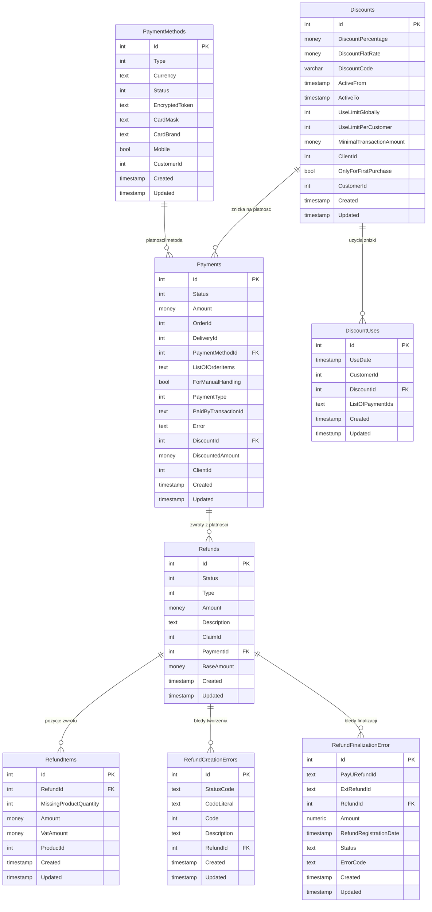

# Diagramy relacji – Bake2Home

Diagramy dla wszystkich 8 baz danych z Dockera. Strzałki pokazują klucze obce (FK).

---

## 1. catalog-db (katalog produktów)

Serce oferty – produkty, oferty, składniki, alergeny, wartości odżywcze.

```mermaid
erDiagram
    BakeryProductsTypes {
        int Id PK
        varchar Name
        text PictureFileName
        int ProductTypeDisplayOrder
        timestamp Created
        timestamp Updated
    }

    BakeryProduct {
        int Id PK
        varchar Name
        varchar Description
        int State
        text PictureFileName
        int BakeryProductsTypeId FK
        int PlatformClientId
        int Weight
        timestamp Created
        timestamp Updated
    }

    Nutrition {
        int Id PK
        bigint Calories
        float TotalFats
        float SaturatedFats
        float TotalCarbohydrates
        float Sugar
        float Protein
        float Sodium
        int ProductId FK
        timestamp Created
        timestamp Updated
    }

    Allergen {
        int Id PK
        varchar Name
        bool IsUsed
        timestamp Created
        timestamp Updated
    }

    ProductAllergen {
        int Id PK
        int AllergenId FK
        int BakeryProductId FK
        timestamp Created
        timestamp Updated
    }

    ProductAttribute {
        int Id PK
        varchar Description
        varchar Value
        int BakeryProductId FK
        timestamp Created
        timestamp Updated
    }

    PublicIngredient {
        int Id PK
        varchar Name
        varchar Unit
        timestamp Created
        timestamp Updated
    }

    PrivateIngredient {
        int Id PK
        int PlatformClientId
        varchar Name
        varchar Unit
        timestamp Created
        timestamp Updated
    }

    ProductPublicIngredient {
        int Id PK
        int BakeryProductId FK
        int IngredientId FK
        float Value
        timestamp Created
        timestamp Updated
    }

    ProductPrivateIngredient {
        int Id PK
        int BakeryProductId FK
        int IngredientId FK
        float Value
        timestamp Created
        timestamp Updated
    }

    BakeryOffer {
        int Id PK
        varchar Name
        numeric Price
        int State
        int Type
        int AvailableStock
        bool IsAvailable
        int PlatformClientId
        int VatRateId
        numeric VAT
        timestamp Created
        timestamp Updated
    }

    OfferProduct {
        int Id PK
        int ProductId FK
        int BakeryOfferId FK
        numeric ProductPrice
        text ProductName
        int ProductCount
        bool IsAvailableInOffer
        numeric ProductInOfferPrice
        numeric VATForProductInOffer
        timestamp Created
        timestamp Updated
    }

    Availability {
        int Id PK
        bool Monday
        bool Tuesday
        bool Wednesday
        bool Thursday
        bool Friday
        bool Saturday
        bool Sunday
        timestamp AvailableDateFrom
        timestamp AvailableDateTo
        timestamp Created
        timestamp Updated
    }

    OfferAvailability {
        int Id PK
        int BakeryOfferId FK
    }

    OfferLocation {
        int Id PK
        int LocationId
        int BakeryOfferId FK
        timestamp Created
        timestamp Updated
    }

    OfferSite {
        int Id PK
        int SiteId
        int BakeryOfferId FK
        timestamp Created
        timestamp Updated
    }

    BakeryProductSiteNew {
        int Id PK
        int BakeryProductId FK
        int SiteId
        timestamp Created
        timestamp Updated
    }

    BakeryProductsTypes ||--o{ BakeryProduct : "typ produktu"
    BakeryProduct ||--|| Nutrition : "wartosci odzywcze"
    BakeryProduct ||--o{ ProductAllergen : "alergeny"
    Allergen ||--o{ ProductAllergen : "alergeny"
    BakeryProduct ||--o{ ProductAttribute : "atrybuty"
    BakeryProduct ||--o{ ProductPublicIngredient : "skladniki publiczne"
    PublicIngredient ||--o{ ProductPublicIngredient : "skladniki publiczne"
    BakeryProduct ||--o{ ProductPrivateIngredient : "skladniki prywatne"
    PrivateIngredient ||--o{ ProductPrivateIngredient : "skladniki prywatne"
    BakeryProduct ||--o{ OfferProduct : "produkty w ofercie"
    BakeryOffer ||--o{ OfferProduct : "produkty w ofercie"
    BakeryOffer ||--o{ OfferAvailability : "dostepnosc"
    Availability ||--|| OfferAvailability : "dostepnosc"
    BakeryOffer ||--o{ OfferLocation : "lokalizacje oferty"
    BakeryOffer ||--o{ OfferSite : "piekarnie oferty"
    BakeryProduct ||--o{ BakeryProductSiteNew : "produkty w piekarniach"
```

---

## 2. client-manager-db (piekarnie, oddziały, obszary)

Struktura organizacyjna – firmy piekarnicze, ich budynki, strefy dostawcze.

---

## 3. customer-manager-db (klienci końcowi)

Ludzie, którzy zamawiają pieczywo.

---

## 4. planner-db (zamówienia)

Serce transakcji – zamówienia klientów, pozycje zamówień, subskrypcje.

---

## 5. delivery-manager-db (dostawy)

Realizacja zamówień – kto, co, komu i kiedy dostarczył.

---

## 6. delivery-account-manager-db (konta dostawców)

Dane osobowe i organizacyjne dostawców.

---

## 7. claim-manager-db (reklamacje)

Obsługa problemów z dostawami.

---

## 8. wallet-db (płatności, zniżki, zwroty)

Cały przepływ pieniędzy.

